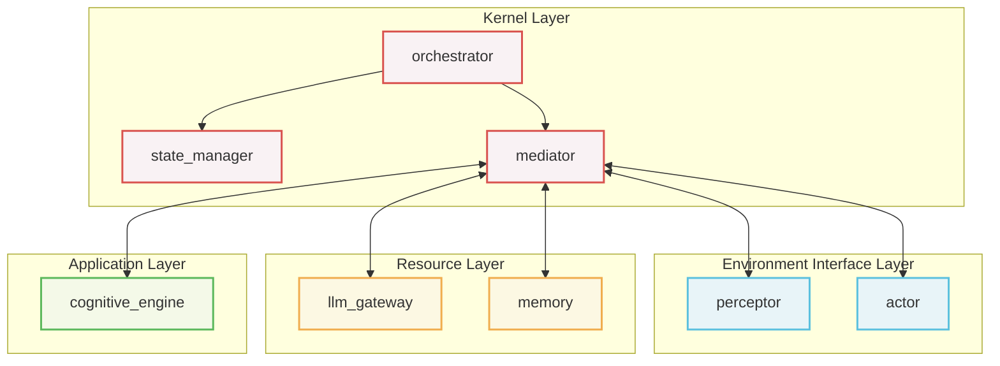

# Narv: An Experimental Architecture for Autonomous Agents


## 0. Status
Experimental.
This architecture is continuously being updated. This is done based on lessons learned from the implementation.


## 1. What is Narv
Narv is an experimental project to develop autonomous agents.
As we solved many challenges during the implementation, we realized that they are conceptually equivalent to those solved by operating systems decades ago. (e.g., IPC, scheduling, resource management, etc.)
As a result, Narv's design has naturally converged on a microkernel architecture.


## 2. Architecture

### 2.1. System Overview


```mermaid
flowchart TB
    %% Style Definitions
    classDef kernelLayer fill:#f9f2f4,stroke:#d9534f,stroke-width:2px,color:#333
    classDef envLayer fill:#e8f4f8,stroke:#5bc0de,stroke-width:2px,color:#333
    classDef resourceLayer fill:#fcf8e3,stroke:#f0ad4e,stroke-width:2px,color:#333
    classDef appLayer fill:#f4f9e8,stroke:#5cb85c,stroke-width:2px,color:#333

    subgraph KernelLayer ["Kernel Layer"]
        state_manager["state_manager"]:::kernelLayer
        
        orchestrator["orchestrator"]:::kernelLayer
        
        mediator["mediator"]:::kernelLayer

        orchestrator --> state_manager
        orchestrator --> mediator
    end

    subgraph EnvironmentInterfaceLayer ["Environment Interface Layer"]
        perceptor["perceptor"]:::envLayer
        actor["actor"]:::envLayer
    end
    
    subgraph ResourceLayer ["Resource Layer"]
        llm_gateway["llm_gateway"]:::resourceLayer
        memory["memory"]:::resourceLayer
    end
    
    subgraph ApplicationLayer ["Application Layer"]
        cognitive_engine["cognitive_engine"]:::appLayer
    end

    %% Routing via Mediator
    mediator <--> cognitive_engine

    mediator <--> perceptor
    mediator <--> actor
    
    mediator <--> memory
    mediator <--> llm_gateway
```

### 2.2. Conceptual mapping to an OS kernel

| Layer                           | Component        | Conceptual mapping to OS kernel | Description                                                                                                        |
| :------------------------------ | :--------------- | :------------------------------ | :----------------------------------------------------------------------------------------------------------------- |
| **Application Layer**           | cognitive_engine | Process                         | Receives LLM and memory allocations from the kernel and executes inference                                         |
| **Kernel Layer**                | mediator         | IPC / System call               | Prohibits direct communication between modules and safely mediates communication                                   |
|                                 | orchestrator     | Process scheduler               | Orchestrates the autonomous loop and determines state transitions and inference modes based on internal parameters |
|                                 | state_manager    | Global data structure           | Manages and persists the state of the entire system                                                                |
| **Resource Layer**              | llm_gateway      | CPU execution interface         | Calls the LLM based on requests from the application and returns the results                                       |
|                                 | memory           | Memory management subsystem     | Hierarchical memory, garbage collection                                                                            |
| **Environment Interface Layer** | actor            | Output device driver            | Executes commands and writes to files upon receiving instructions from the kernel                                  |
|                                 | perceptor        | Input device driver             | Periodically reads the environment and converts it into a standard format that is easy for the kernel to process   |


## 3. Lessons Learned
A causal graph is adopted for the memory, and the LLM outputs the UUID of the referenced context, correlating the current inference with the previous inference.
However, because LLMs are poor at generating meaningless strings like UUIDs, a bug occurred where dummy UUIDs were output and the causal graph did not grow. Therefore, we implemented logic in the `cognitive_engine` to perform mutual conversion between the UUID and its alias ("REF-XXX", which is easy for the LLM to output).
Looking back later, this logic was conceptually a page table for virtual memory. From the perspective of microkernel architecture and Separation of Concerns, one realizes that this is logic that should be shared across the entire system, and is the responsibility of the `mediator`, not the `cognitive_engine`. (Issue - #12).


## 4. Design Principles
- The kernel manages the state of the entire system.
- Treat the LLM as a finite computational resource.
- Direct calls between modules are prohibited, and all communication is made to go through the mediator.
- Prevent module failures from propagating to the entire system, and safely fall back via the mediator.


## 5. How to Start

### Prerequisites
* **API Key** — An API key for an LLM (e.g., OpenAI, Anthropic, Gemini), or any provider supported by [litellm](https://docs.litellm.ai/docs/providers)
* **Docker & Docker Compose**

### 5.1. Clone

```bash
git clone https://github.com/narv-lab/narv.git
cd narv

```

### 5.2. Setting Environment Variables

```bash
cp .env.example .env
# Add the API key to .env

```

### 5.3. Model Configuration

Edit the `api` section of `config.yaml` and specify the models you want to use.

```yaml
api:
  model_fast: "google/gemini-3.1-flash-lite"
  model_slow: "google/gemini-3.1-pro-preview"
  model_embed: "google/gemini-embedding-2-preview"

```

### 5.4. Starting the Services

```bash
docker compose up -d

```

### 5.5. Opening the Web Interface

```
http://localhost:8501/

```


## 6. Contributing

Although the system structurally adopts a loosely coupled microkernel architecture, its **cognitive framework** relies on a highly delicate internal balance. Superficial code optimizations or feature additions to any single component can unintentionally disrupt this cognitive balance, leading to the collapse of the system's emergent behaviors.

**We are not accepting PRs to the main branch at this stage.**

We encourage a divergent model instead:

1. **Fork and experiment.** Clone Narv, alter its prompt templates, swap memory backends, tune thresholds.
2. **Report findings.** If you find an interesting failure mode, an optimal TTL ratio, or a useful prompt variation, open an Issue with your logs.
3. **Research collaboration.** If you're interested in formally analyzing the architecture, reach out via [our inquiry form](https://forms.gle/SzDgqpmxC5yFXLQa8).


## 7. License

**Community License**

This project is intended for learning, experimentation, research, education, hobby projects, and other non-commercial purposes.

Commercial use—including integration into commercial products, SaaS offerings, or paid services—requires a separate commercial license.

See the [LICENSE](LICENSE) file for details.
[Commercial Use & General Inquiries](https://forms.gle/SzDgqpmxC5yFXLQa8)
