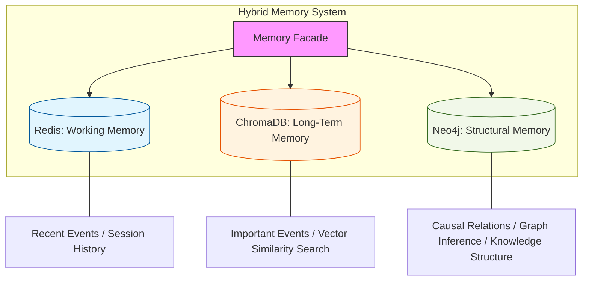
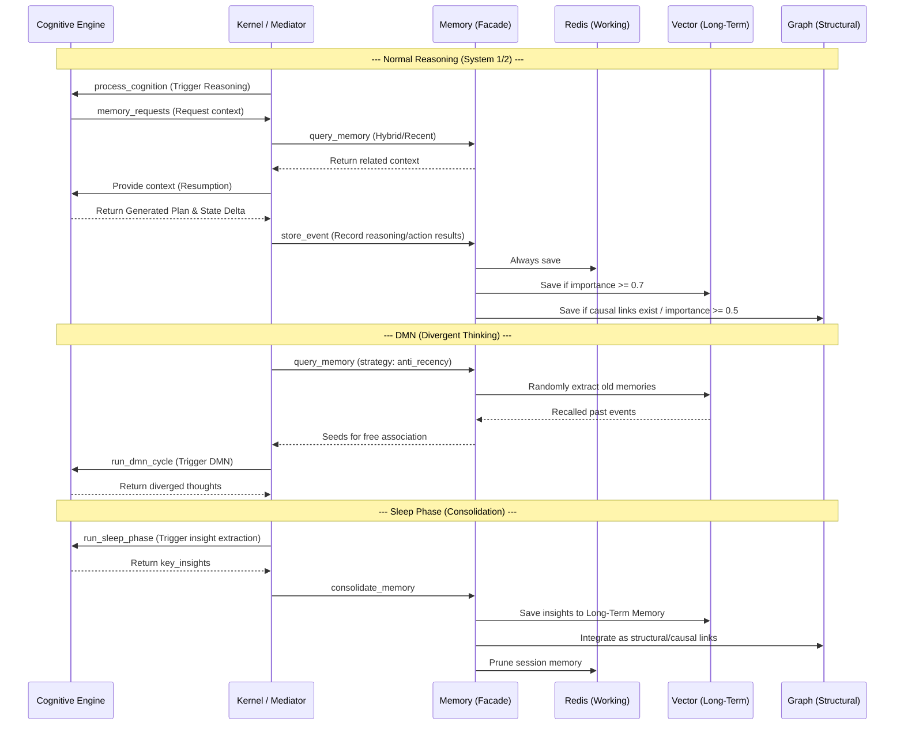

### 1. Memory Structure (Hierarchical Hybrid Memory Architecture)

Memory is classified into the following three layers based on speed and characteristics:

* **Working Memory**: Uses Redis. Retains the short-term history of the current session.
* **Long-Term Memory**: Uses ChromaDB (Vector DB). Stores high-importance events and summarized perceptions, enabling vector similarity searches.
* **Structural Memory**: Uses Neo4j (Graph DB). Maintains causal relationships and structural connections between events.

---

### 2. Memory Operations in Each Cognitive Phase

During each phase (System 1/2, DMN, Reflection, Sleep), the memory modules are accessed using different strategies.

#### Summary of Memory Operations

| Cognitive Phase | Primary Memory Operations | Description of Operations |
| :--- | :--- | :--- |
| **System 1 (FAST)** | `get_recent` (Redis) / `store_event` | Refers only to recent history and writes results immediately. |
| **System 2 (SLOW)** | `query_memory` (Hybrid) / `store_event` | Recalls related memories via vector/keyword search and records details comprehensively. |
| **DMN (Divergent)** | `query_memory` (anti_recency) | Intentionally extracts the "oldest memories" randomly to diversify thoughts. |
| **Reflection** | `get_session_memory` (Redis) | Reviews recent action history to find contradictions or perform self-correction. |
| **Sleep (Consolidation)** | `consolidate_memory` | Abstracts session memory, anchors insights into long-term and graph memory, and prunes Redis. |

#### Interaction Flow Between Cognitive Phases and Memory

### Supplementary: Specific Roles and Operations of Each Storage
* **Redis**: Constantly written via `store_event` and used to maintain the current context via `get_recent`.
* **ChromaDB**: Targeted for saving events with an `importance` of 0.7 or higher, and is also used for unearthing old memories via the `anti_recency` strategy.
* **Neo4j**: Structurally saves events when `causal_links` are present. Used for causal exploration via the `graph_traversal` strategy.
