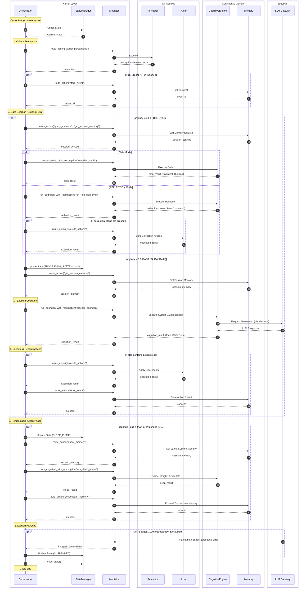

```mermaid
sequenceDiagram
    autonumber
    
    box Kernel Layer
        participant O as Orchestrator
        participant SM as StateManager
        participant M as Mediator
    end

    box I/O Modules
        participant P as Perceptor
        participant A as Actor
    end

    box Cognition & Memory
        participant CE as CognitiveEngine
        participant Mem as Memory
    end

    box External
        participant LLM as LLM Gateway
    end

    Note over O: Cycle Start (execute_cycle)
    O->>SM: Check State
    SM-->>O: Current State

    Note over O: 1. Collect Perceptions
    O->>M: route_action("gather_perceptions")
    M->>P: Execute
    P-->>M: perceptions (events, etc.)
    M-->>O: perceptions

    opt If USER_INPUT is included
        O->>M: route_action("store_event")
        M->>Mem: Store Event
        Mem-->>M: event_id
        M-->>O: event_id
    end

    Note over O: 2. Gate Decision (Urgency Eval)
    
    alt urgency == 0.0 (IDLE Cycle)
        O->>M: route_action("query_memory" / "get_session_memory")
        M->>Mem: Get Memory Context
        Mem-->>M: session_context
        M-->>O: session_context
        
        alt DMN Mode
            O->>M: run_cognition_with_resumption("run_dmn_cycle")
            M->>CE: Execute DMN
            CE-->>M: dmn_result (Divergent Thinking)
            M-->>O: dmn_result
        else REFLECTION Mode
            O->>M: run_cognition_with_resumption("run_reflection_cycle")
            M->>CE: Execute Reflection
            CE-->>M: reflection_result (State Correction)
            M-->>O: reflection_result
            opt If correction_steps are present
                O->>M: route_action("execute_actions")
                M->>A: Safe Correction Actions
                A-->>M: execution_result
                M-->>O: execution_result
            end
        end

    else urgency > 0.0 (FAST / SLOW Cycle)
        O->>SM: Update State (PROCESSING_SYSTEM1 or 2)
        O->>M: route_action("get_session_memory")
        M->>Mem: Get Session Memory
        Mem-->>M: session_memory
        M-->>O: session_memory

        Note over O: 3. Execute Cognition
        O->>M: run_cognition_with_resumption("process_cognition")
        M->>CE: Execute System 1/2 Reasoning
        CE->>LLM: Request Generation (via Mediator)
        LLM-->>CE: LLM Response
        CE-->>M: cognition_result (Plan, State Delta)
        M-->>O: cognition_result
        
        Note over O: 4. Execute & Record Actions
        opt If plan contains action steps
            O->>M: route_action("execute_actions")
            M->>A: Apply Side-effects
            A-->>M: execution_result
            M-->>O: execution_result
            
            O->>M: route_action("store_event")
            M->>Mem: Store Action Result
            Mem-->>M: success
            M-->>O: success
        end
    end

    Note over O: 5. Homeostasis (Sleep Phase)
    opt cognitive_load > MAX or Prolonged IDLE
        O->>SM: Update State (SLEEP_PHASE)
        O->>M: route_action("query_memory")
        M->>Mem: Get Latest Session Memory
        Mem-->>M: session_memory
        M-->>O: session_memory
        
        O->>M: run_cognition_with_resumption("run_sleep_phase")
        M->>CE: Extract Insights / Simulate
        CE-->>M: sleep_result
        M-->>O: sleep_result
        
        O->>M: route_action("consolidate_memory")
        M->>Mem: Prune & Consolidate Memory
        Mem-->>M: success
        M-->>O: success
    end

    Note over O: Exception Handling
    opt API Budget (1000 requests/day) Exhausted
        LLM--xM: Rate Limit / Budget Exceeded Error
        M--xO: BudgetExceededError
        O->>SM: Update State (SUSPENDED)
    end

    O->>SM: save_state()
    Note over O: Cycle End
```
