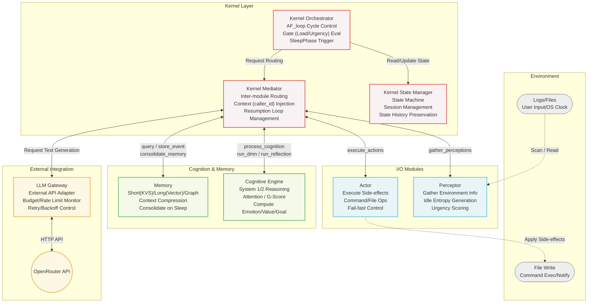

```mermaid
flowchart TB
    %% Style Definitions
    classDef kernel fill:#f9f2f4,stroke:#d9534f,stroke-width:2px,color:#333
    classDef io fill:#e8f4f8,stroke:#5bc0de,stroke-width:2px,color:#333
    classDef cog fill:#f4f9e8,stroke:#5cb85c,stroke-width:2px,color:#333
    classDef ext fill:#fcf8e3,stroke:#f0ad4e,stroke-width:2px,color:#333
    classDef env fill:#eee,stroke:#999,stroke-width:1px,color:#333

    subgraph Environment ["Environment"]
        EnvIn(["Logs/Files<br>User Input/OS Clock"]):::env
        EnvOut(["File Write<br>Command Exec/Notify"]):::env
    end

    subgraph KernelGroup ["Kernel Layer"]
        SM["Kernel State Manager<br>State Machine<br>Session Management<br>State History Preservation"]:::kernel
        
        O["Kernel Orchestrator<br>AF_loop Cycle Control<br>Gate (Load/Urgency) Eval<br>SleepPhase Trigger"]:::kernel
        
        M["Kernel Mediator<br>Inter-module Routing<br>Context (caller_id) Injection<br>Resumption Loop Management"]:::kernel

        O -->|"Read/Update State"| SM
        O -->|"Request Routing"| M
    end

    subgraph IOGroup ["I/O Modules"]
        P["Perceptor<br>Gather Environment Info<br>Idle Entropy Generation<br>Urgency Scoring"]:::io
        A["Actor<br>Execute Side-effects<br>Command/File Ops<br>Fail-fast Control"]:::io
    end

    subgraph CognitionGroup ["Cognition & Memory"]
        CE["Cognitive Engine<br>System 1/2 Reasoning<br>Attention / G-Score<br>Compute Emotion/Value/Goal"]:::cog
        Mem["Memory<br>Short(KVS)/Long(Vector)/Graph<br>Context Compression<br>Consolidate on Sleep"]:::cog
    end

    subgraph ExternalGroup ["External Integration"]
        LLM["LLM Gateway<br>External API Adapter<br>Budget/Rate Limit Monitor<br>Retry/Backoff Control"]:::ext
        OpenRouter(("OpenRouter API")):::ext
    end

    %% Routing via Mediator
    M <-->|"gather_perceptions"| P
    M <-->|"execute_actions"| A
    M <-->|"process_cognition<br>run_dmn / run_reflection"| CE
    M <-->|"query / store_event<br>consolidate_memory"| Mem
    M <-->|"Request Text Generation"| LLM

    %% Interactions with Environment and External APIs
    EnvIn -.->|"Scan / Read"| P
    A -.->|"Apply Side-effects"| EnvOut
    LLM <-->|"HTTP API"| OpenRouter
```
